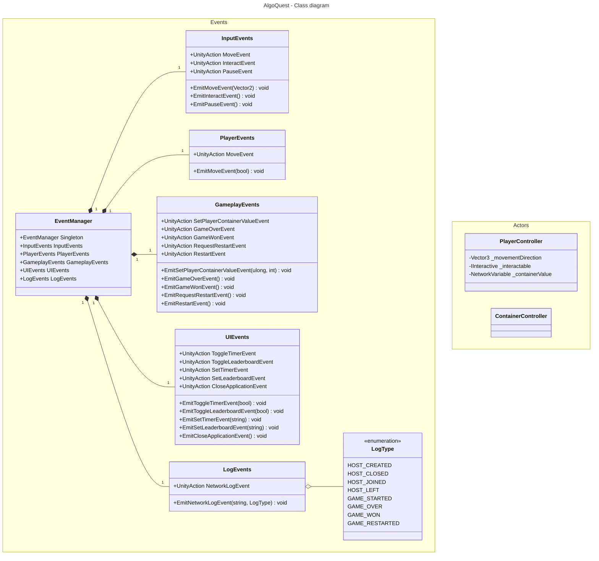

```mermaid
---
title: AlgoQuest - Class diagram
---
classDiagram
  namespace Events {
    class InputEvents {
      +UnityAction MoveEvent
      +UnityAction InteractEvent
      +UnityAction PauseEvent

      +EmitMoveEvent(Vector2) void
      +EmitInteractEvent() void
      +EmitPauseEvent() void
    }

    class PlayerEvents {
      +UnityAction MoveEvent

      +EmitMoveEvent(bool) void
    }

    class GameplayEvents {
      +UnityAction SetPlayerContainerValueEvent
      +UnityAction GameOverEvent
      +UnityAction GameWonEvent
      +UnityAction RequestRestartEvent
      +UnityAction RestartEvent

      +EmitSetPlayerContainerValueEvent(ulong, int) void
      +EmitGameOverEvent() void
      +EmitGameWonEvent() void
      +EmitRequestRestartEvent() void
      +EmitRestartEvent() void
    }

    class UIEvents {
      +UnityAction ToggleTimerEvent
      +UnityAction ToggleLeaderboardEvent
      +UnityAction SetTimerEvent
      +UnityAction SetLeaderboardEvent
      +UnityAction CloseApplicationEvent

      +EmitToggleTimerEvent(bool) void
      +EmitToggleLeaderboardEvent(bool) void
      +EmitSetTimerEvent(string) void
      +EmitSetLeaderboardEvent(string) void
      +EmitCloseApplicationEvent() void
    }

    class LogType {
      <<enumeration>>
      HOST_CREATED
      HOST_CLOSED
      HOST_JOINED
      HOST_LEFT
      GAME_STARTED
      GAME_OVER
      GAME_WON
      GAME_RESTARTED
    }

    class LogEvents {
      +UnityAction NetworkLogEvent

      +EmitNetworkLogEvent(string, LogType) void
    }

    class EventManager {
      +EventManager Singleton
      +InputEvents InputEvents
      +PlayerEvents PlayerEvents
      +GameplayEvents GameplayEvents
      +UIEvents UIEvents
      +LogEvents LogEvents
    }
  }

  EventManager "1" *-- "1" InputEvents
  EventManager "1" *-- "1" PlayerEvents
  EventManager "1" *-- "1" GameplayEvents
  EventManager "1" *-- "1" UIEvents
  EventManager "1" *-- "1" LogEvents
  LogEvents o-- LogType

  namespace Actors {
    class PlayerController {
      -Vector3 _movementDirection
      -IInteractive _interactable
      -NetworkVariable _containerValue
    }

    class ContainerController {

    }
  }
```
