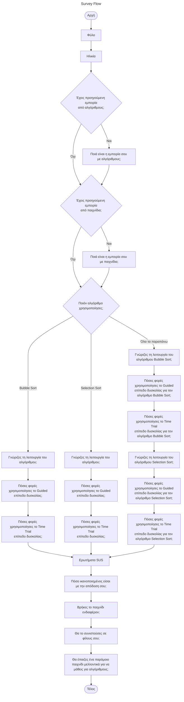

```mermaid
---
title: Survey Flow
---
graph TD;
    A([Αρχή]) --> B[Φύλο];
    B --> C[Ηλικία];

    C --> D{Έχεις προηγούμενη εμπειρία\nαπό αλγόριθμους;}
    D --> |Ναι| E[Ποιά είναι η εμπειρία σου με αλγόριθμους;]
    D --> |Όχι| F{Έχεις προηγούμενη εμπειρία\nαπό παιχνίδια;}
    E --> F

    F --> |Ναι| G[Ποιά είναι η εμπειρία σου με παιχνίδια;]
    F --> |Όχι| H{Ποιόν αλγόριθμο χρησιμοποίησες;}
    G --> H

    H --> |Bubble Sort| I[Γνώριζες τη λειτουργία του αλγόριθμου;]
    I --> J[Πόσες φορές χρησιμοποίησες το Guided\nεπίπεδο δυσκολίας;]
    J --> K[Πόσες φορές χρησιμοποίησες το Time Trial\nεπίπεδο δυσκολίας;]

    H --> |Selection Sort| L[Γνώριζες τη λειτουργία του αλγόριθμου;]
    L --> M[Πόσες φορές χρησιμοποίησες το Guided\nεπίπεδο δυσκολίας;]
    M --> N[Πόσες φορές χρησιμοποίησες το Time Trial\nεπίπεδο δυσκολίας;]

    H --> |Όλα τα παραπάνω| O[Γνώριζες τη λειτουργία του\nαλγόριθμου Bubble Sort;]
    O --> P[Πόσες φορές χρησιμοποίησες το Guided\nεπίπεδο δυσκολίας για τον αλγόριθμο Bubble Sort;]
    P --> Q[Πόσες φορές χρησιμοποίησες το Time Trial\nεπίπεδο δυσκολίας για τον αλγόριθμο Bubble Sort;]
    Q --> R[Γνώριζες τη λειτουργία του\nαλγόριθμου Selection Sort;]
    R --> S[Πόσες φορές χρησιμοποίησες το Guided\nεπίπεδο δυσκολίας για τον αλγόριθμο Selection Sort;]
    S --> T[Πόσες φορές χρησιμοποίησες το Time Trial\nεπίπεδο δυσκολίας για τον αλγόριθμο Selection Sort;]

    K --> U[Ερωτήματα SUS]
    N --> U
    T --> U

    U --> V[Πόσο ικανοποιημένος είσαι με την απόδοση σου;]
    V --> W[Βρήκες το παιχνίδι ενδιαφέρον;]
    W --> X[Θα το συνιστούσες σε φίλους σου;]
    X --> Y[Θα έπαιζες ένα παρόμοιο παιχνίδι μελλοντικά για να μάθεις για αλγόριθμους;]

    Y --> Z([Τέλος])
```
