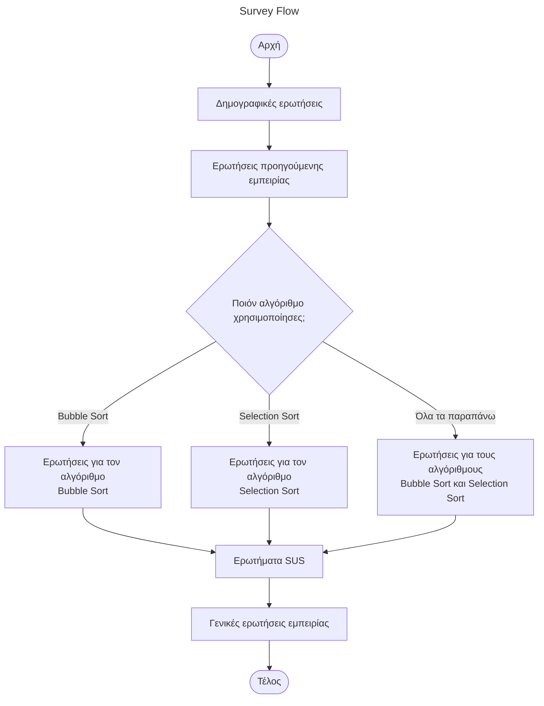

```mermaid
---
title: Survey Flow
---
graph TD;
    A([Αρχή]) --> B[Δημογραφικές ερωτήσεις]

    B --> C[Ερωτήσεις προηγούμενης εμπειρίας]
    C --> D{Ποιόν αλγόριθμο χρησιμοποίησες;}

    D --> |Bubble Sort| E[Ερωτήσεις για τον αλγόριθμο\nBubble Sort]
    D --> |Selection Sort| F[Ερωτήσεις για τον αλγόριθμο\nSelection Sort]
    D --> |Όλα τα παραπάνω| G[Ερωτήσεις για τους αλγόριθμους\nBubble Sort και Selection Sort]


    E --> H[Ερωτήματα SUS]
    F --> H
    G --> H

    H --> I[Γενικές ερωτήσεις εμπειρίας]
    I --> J([Τέλος])
```
