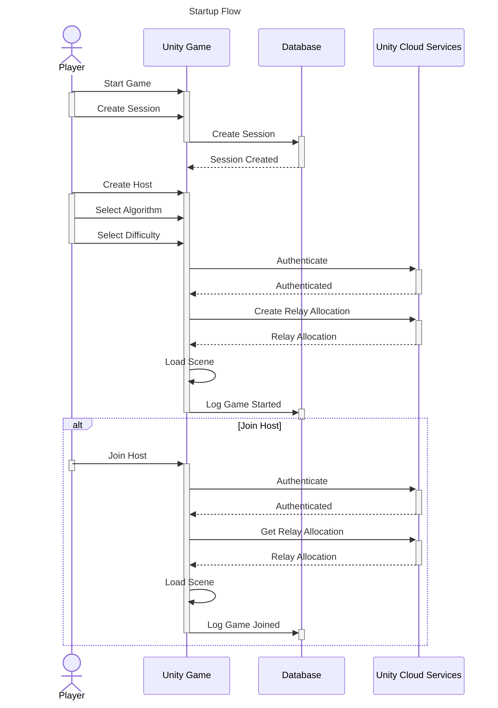

```mermaid
---
title: Startup Flow
---
sequenceDiagram
  actor Player
  participant Unity Game
  participant Database
  participant Unity Cloud Services

  Player->>+Unity Game: Start Game
  activate Player
  Player->>Unity Game: Create Session
  deactivate Player
  Unity Game->>+Database: Create Session
  deactivate Unity Game
  Database-->>-Unity Game: Session Created
  Player->>+Unity Game: Create Host
  activate Player
  Player->>Unity Game: Select Algorithm
  Player->>Unity Game: Select Difficulty
  deactivate Player
  Unity Game->>+Unity Cloud Services: Authenticate
  Unity Cloud Services-->>-Unity Game: Authenticated
  Unity Game->>+Unity Cloud Services: Create Relay Allocation
  Unity Cloud Services-->>-Unity Game: Relay Allocation
  Unity Game->>Unity Game: Load Scene
  Unity Game->>+Database: Log Game Started
  deactivate Database
  deactivate Unity Game

  alt Join Host
    Player->>+Unity Game: Join Host
    activate Player
    deactivate Player
    Unity Game->>+Unity Cloud Services: Authenticate
    Unity Cloud Services-->>-Unity Game: Authenticated
    Unity Game->>+Unity Cloud Services: Get Relay Allocation
    Unity Cloud Services-->>-Unity Game: Relay Allocation
    Unity Game->>Unity Game: Load Scene
    Unity Game->>+Database: Log Game Joined
    deactivate Database
    deactivate Unity Game
  end
```
